# Session: Health & Fitness (FACE)

## How to Make Any Habit Permanent?

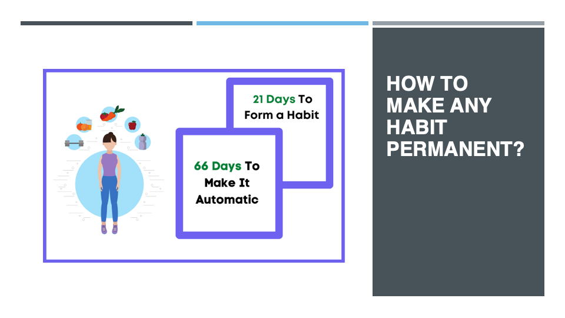

***
 

## How to Measure Whether You are Healthy or Not?

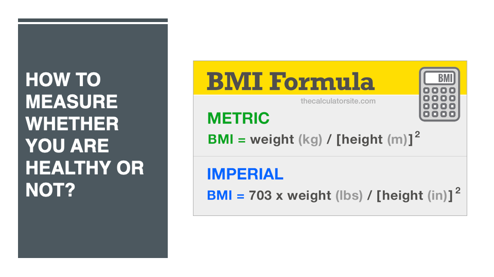

***
 

## Motivation Factor

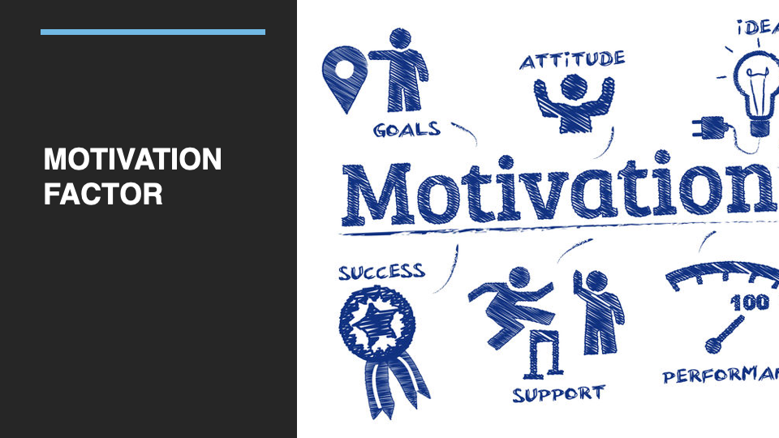

***
 

## FACE RIDDLE #1

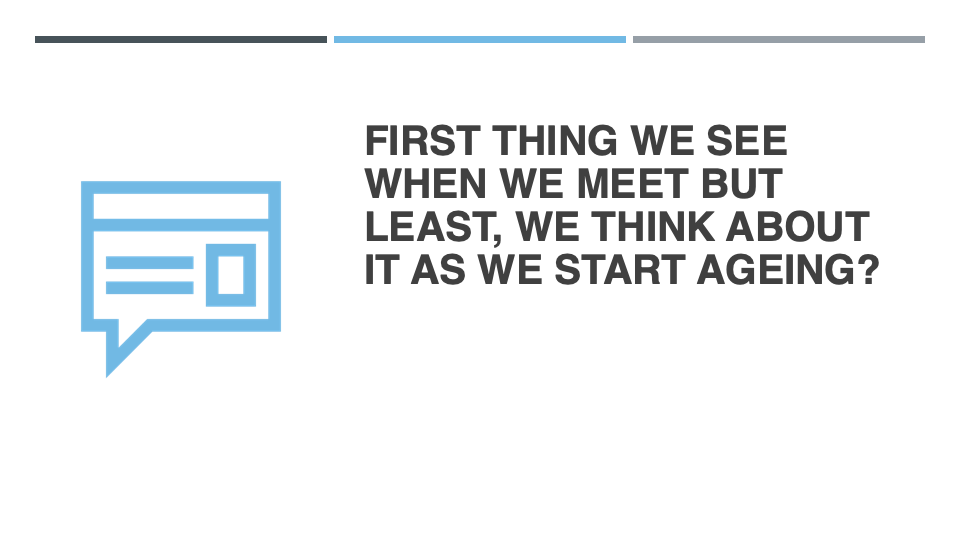

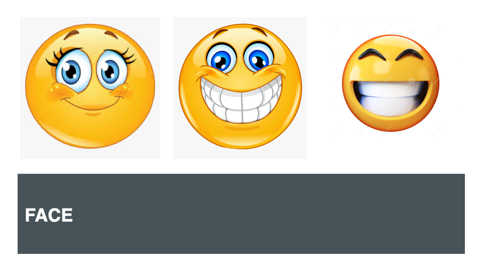

***
 

## FACE FACT #1

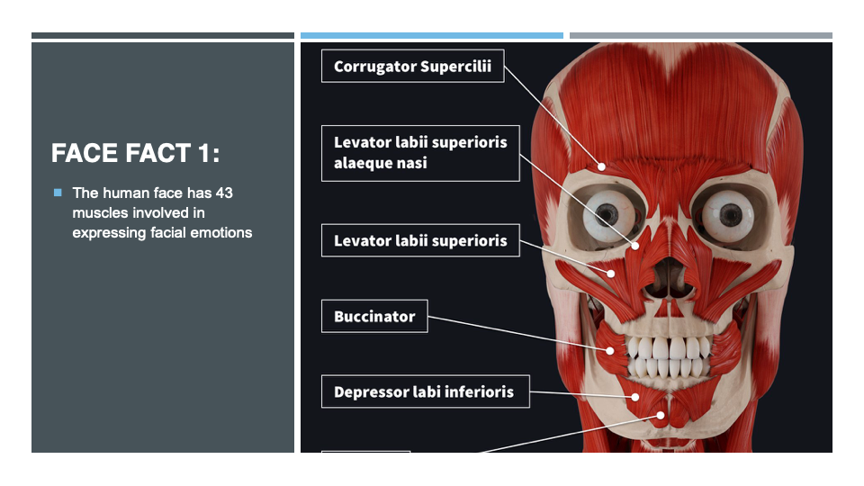

***
 

## Problems Regarding Face

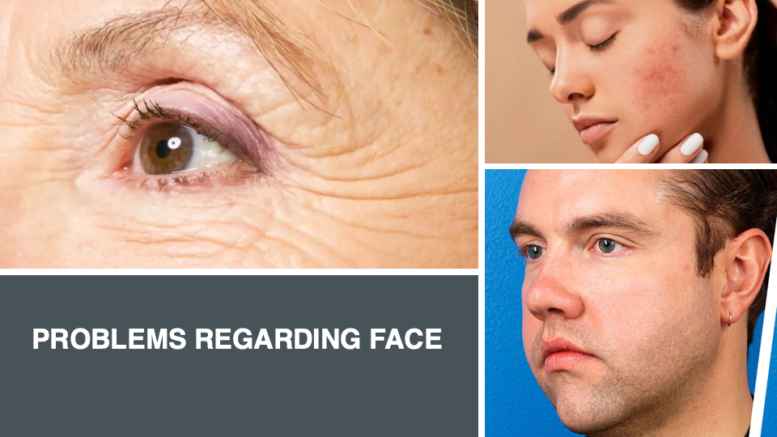

***
 

## FACE FACT #2

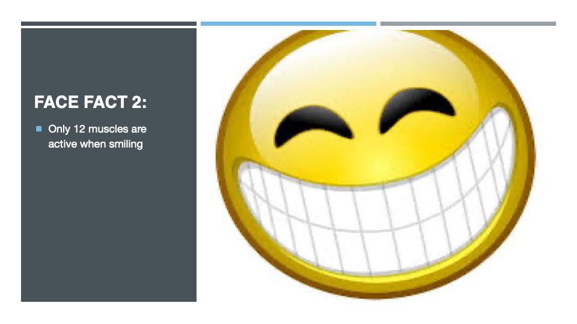

***
 

## Reason Behind Face Problems

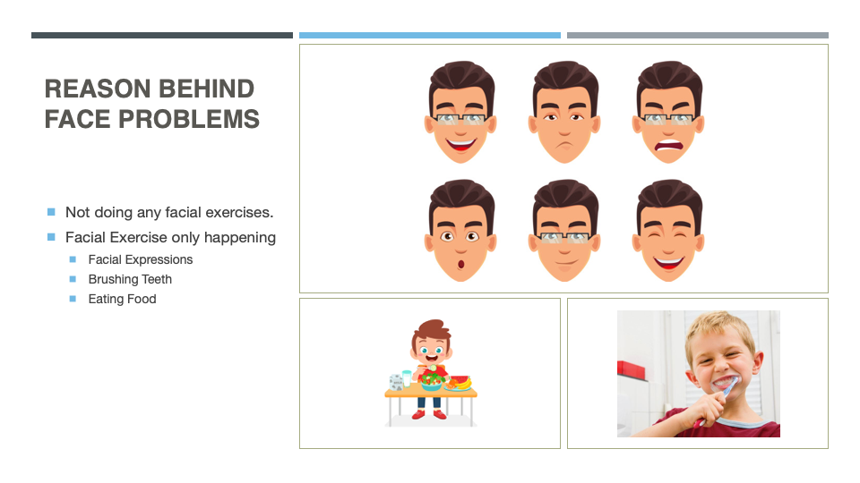

***
 

## FACE FACT #3

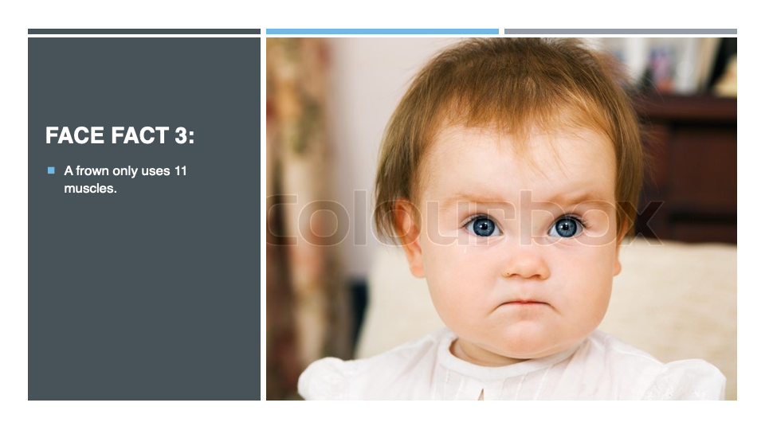

***
 

## TIP #1

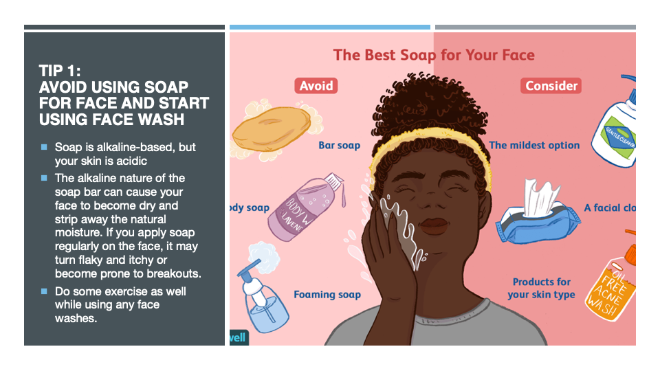

***
 

## FACE FACT #4

***
 

## TIP #2

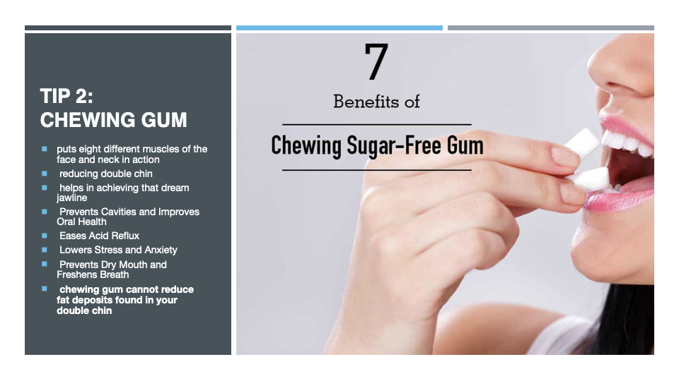

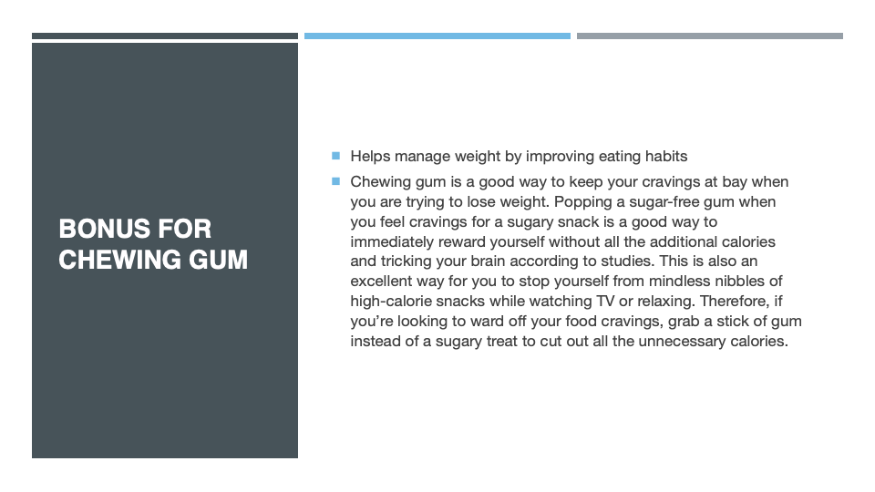

***
 

## FACE FACT #5

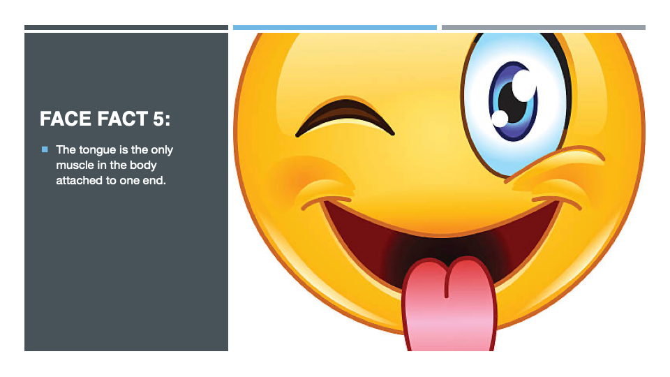

***
 

## TIP #3

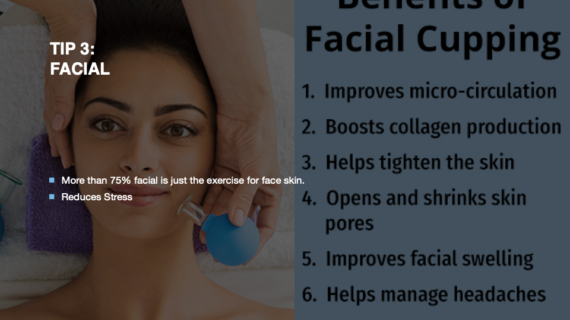
